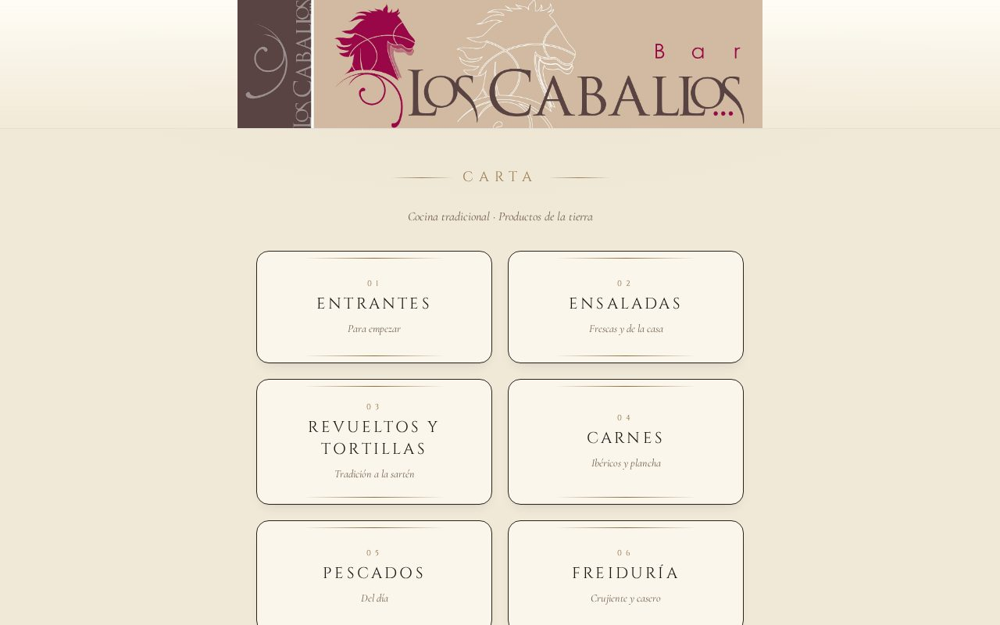

# Bar Los Caballos

Carta digital de Bar Los Caballos.

🔗 **[barloscaballos.es](https://barloscaballos.es/)**

## Qué incluye

- Carta por secciones: entrantes, carnes ibéricas, pescados, freiduría, vinos…
- Pensada para abrirse desde el QR de la mesa
- Dominio propio

## Tecnologías

  

---

Proyecto desarrollado por [PuntoZero](https://puntozerosl.es).
